Minetest wrench for rotating nodes (rotate:wrench)
==================================================

This wrench (not to be confused with the technic wrench) makes the rotating
of nodes much more intuitive.

Different wrenches (wood, steel, copper, gold):

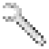
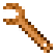
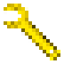

Modes of operation
------------------

The wrench has three major modes of operation:

1) Rotation mode.
	In this mode, when punching a node, the node is rotated 90 degrees, the
	direction depending on the selected sub-mode. The following sub-modes are
	available:

	- clock-wise: rotate the node so that the punched side rotates clockwise
	- counter-clock-wise: rotate the node so that the punched side rotates
	  counter-clockwise
	- left: rotate the node so that the punched side moves to the left
	- right: rotate the node so that the punched side moves to the right
	- up: rotate the node so that the punched side moves upwards
	- down: rotate the node so that the punched side moves downwards

	The desired sub-mode is cycled by right-clicking. With the mode, the picture
	of the wrench changes to indicate which mode is selected.

	As multiple rotations are most likely needed to correctly position a node,
	subsequent rotations of the same node do not add additional wear to the wrench.
	Punching 2 nodes alternatingly *does* add wear on every punch.

	Submodes (none, clockwise, counter-clockwise, left, right up, down):

	.. image:: images/wrench_copper.png
	.. image:: images/wrench_copper_cw.png
	.. image:: images/wrench_copper_ccw.png
	.. image:: images/wrench_copper_left.png
	.. image:: images/wrench_copper_right.png
	.. image:: images/wrench_copper_up.png
	.. image:: images/wrench_copper_down.png

2) Positioning mode (absolute)
	In this mode, when punching a node, the node is rotated to a preconfigured
	orientation with respect to the world. I.e. whatever the initial orientation
	of nodes, after rotation the sides will always be in the same direction (north,
	east, south, west, up, down).

	This mode is selected by crafting a wrench into absolute positioning mode. It
	can later be crafted into any other mode. See below.

	The desired position is configured by right-clicking any node, which configures
	the wrench to the current orientation of the clicked-node. For most regular nodes,
	which don't have an orientation, this resets the wrench to the default orientation.

	Example images (see below for details):

	.. image:: images/wrench_positioning_absolute_axis_rot.png
	.. image:: images/wrench_positioning_absolute_cube.png
	.. image:: images/wrench_positioning_absolute_cube_2.png

2) Positioning mode (relative)
	In this mode, when punching a node, the node is rotated to a preconfigured
	orientation with respect to the punched side and the player. I.e. if the wrench
	is configured by right-clicking a specific side of a node, then when another
	node is re-oriented, the punched side will match the punched side of the original
	node (i.e. same side and same rotation).
	For example, this can be used to ensure that chests have their locks facing
	the correct side, by simply punching the chest once on the desired side.

	The relative positioning mode is otherwise comparable to the absolute positioning
	mode.

	A note for the interested: the reference side of the relative positioning mode
	is north. I.e. after right-clicking the north side of a node, the positioning
	submode indicator (see below) of the absolute and of the relative wrench will
	indicate the same.

	Example images (see below for details):

	.. image:: images/wrench_positioning_relative_axis_rot.png
	.. image:: images/wrench_positioning_relative_cube.png
	.. image:: images/wrench_positioning_relative_cube_2.png

Graphical indication of positioning modes:
------------------------------------------

For the absolute and relative positioning modes, two possible graphical
representations of the current submode are available: 'axis_rot' and 'cube'.
The 'cube' representation is recommended.
A third mode is supported, 'linear', but no corresponding images are included.

**Axis / rotation representation**

The 'axis_rot' orientation mode representation uses red dots (for absolute mode)
or blue dots (for relative mode) on a black background, in the upper-right corner
of the image.
The left dot indicates the axis direction: up, north, south, east, west, down
respectively.
The right dot indicates the rotation: 0, 90, 180 and 270 degrees respectively.

Absolute and relative positioning wrenches ('axis_rot' representation):

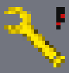
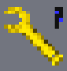

**Cube representation**

The 'cube' orientation mode representation displays an exploded cube on a black
background. In the top-right, a tiny dot indicates absolute mode (red) or relative
mode (blue).
The cube itself has six colors, and one should imagine looking at it from the front.
In the default orientation (axis=up and rotation=0), as seen from the north, the
white face would be directly in front (i.e. north), the blue face would be on top,
the brown face on the bottom, the red face on the right (west), the green face on
the left (east) (just like for boats, airplanes, etc.), and the black (actually
dark grey) face at the back (south).
If the wrench is in absolute positioning mode, any node punched will have the side
corresponding to the center color ending up north, the side corresponding to the
top color upwards, etc.
E.g. if the center color is blue, the original top side will be facing north.
If the wrench is in relative positioning mode, any node will have the side
corresponding to the center color rotate to the place of the punched node (i.e.
in front of the player). The side corresponding to the right color will be to
the right of the player, etc.
E.g. if if the center color is blue, the original top side will become the punched
node (facing the player).

Absolute and relative positioning wrenches ('cube' representation):

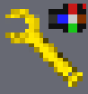
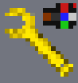
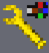
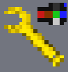

Wrench materials
----------------

Wrenches comes in four versions: wooden (optional), steel, copper, gold. The wooden
wrench is exceptionally cheap, and wears very fast (approx. 10 uses). The steel
wrench has approx 450 uses, the copper wrench approx. 1.5 times as many, the golden
wrench approx 2 times as many. The number of uses of the steel wrench can be
configured, automatically changing those of the copper and gold wrenches as well
(but note that wrenches are expensive: they require 4 ingots, which is double the
amount of a screwdriver).

Crafting
--------

A wrench is crafted using 4 ingots (or 4 sticks for the wooden wrench). In case of
conflict with another mod, a few alternative recipies are available.

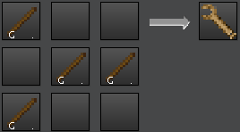
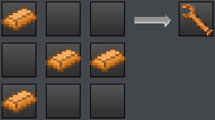

A rotation-mode wrench can also be crafted to a relative positioning mode wrench,
which can be crafted to an absolute positioning mode wrench, which can be crafted
back to a rotation-mode wrench.

Other notes
-----------

The operation of the wrench has been optimized: all required information is precomputed
at startup. Actual operation of a wrench basically requires just a few table lookups.

Most images used for the wrench were generated from a few base images. The script is
and base images are included, for the interested party.

